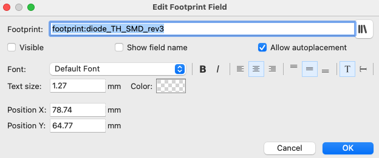

KiCAD7 Tutorial

# 目的

この文書は KiCAD7 を使うための tutorial である。KiCAD は無料で入手できて商用にも自由に利用できる。KiCAD は回路図の作成からプリント基板を作るためのデータ生成までに対応しており、自分で回路図を作成し、基板を発注するまでに対応する。

# 背景

中国の基板製造業者にお願いすると2週間程度で基板を作って送付してくれるサービスが複数ある。そのため、たとえ一枚しか必要ではない試作においてもユニバーサル基板ではんだ付けをするよりもプリント基板を作るという選択肢が出てくる。

まずユニバーサル基板で作れる比較的簡単ものであっても部品のリード線の足を曲げて、ちんたら半田付けしていくなんてもう二度とやりたくない。2.54mmピッチでない部品を使う場合にも余計な加工をすることもなくて、完成後の基板の堅牢性を考えてもよりよい選択肢になる。またユニバーサル基板は、作成後の部品交換が簡単ではないし、少し改良した二台目を作る気力も出てこないし、そもそも作業に時間もかかるのでプリント基板を作ってしまうのが手っ取り早い。

また自分で露光してプリント基板を作ることに較べるとごくごく簡単である。自分で回路のパターンを作って感光して薬品でエッチングして、ドリルで部品用の穴を開ける作業なんて二度とやる気持ちになれない。

つまりは、KiCAD でさっさと回路図を書いて基板を作ってしまう方が発送を待つ期間が生じてしまい実際の回路を利用するまでの時間がかかるものの、自分のトータルの作業時間としては圧倒的に短くなり楽になる。

## 費用

例えば、2023年2月時点でJLCPCBの場合、5枚で10cmx10cm以内のPCBなら$4から$2へのdiscountとなっている。送料は発送方法はFedexなど選択できるが、一番安いOCSならPCB作成+shipping費用で合計 $3.06 である。1ドル135円で計算すると送料込みで500円もかからないことが分かる。この価格なら一枚しか作らない基板でも KiCAD で作って発注してみようかという気になる。

## 対象

ここでの KiCAD は Version 7.00 で、利用する Mac OS はVentrura 13.1 とする。

## install

まずはこちらのページを開き、install する。
https://www.kicad.org/download/macos/

Reaadmeに書いてある通り、download した pacakge を double click して起動する。そして、Application folder に copyする。example folderはinstallしなくてもよいだろう。

# 全体像

そもそも本家のkicad.orgのdocumentを読めばいいのであるが、正直分かりやすいとは言い難い。また、それぞれの機能の詳細なマニュアルはあるがそれは使い方がある程度、理解している人が詳細を知るための位置づけであって、初級者が見ても詳細すぎると思われる。

回路図を書いて、それぞれの部品に footprint を割り当てる。そして、DRCをかけてエラーがないことを確認する。次にプリント基板の外形を作り、その中に部品を配置し、配線する。ここでもDRCを抱えてエラーを確認する。
最後にGerberを出力して基板製作の会社に発注する。

大きくはこれだけであるが、利用したい部品のsymbolがなかったり、footprintがなかったりする場合には自分でそれらの部品を作る必要がある。また配線だけでもパターンの太さを変えたり、自動配線機能を使ったりとといろいろある。それらを補足して説明する。

SVG

## Schematic Editor

基本操作は、'a' で部品を追加し、'w'で配線をする。'f'で footprintを選択する。

スイッチなど同じものがたくさんある場合には一つずつ割り当てずに
menu より'Run footprint assignment tool'を選択し、一気に割り当てたほうが楽である。

### Tips

* 階層sheetを使うと複数の回路図でごちゃごちゃせず見通しがよくなる。

## Symbol Editor

## PCB Editor

### 自動配線

#### Plug-inの install

#### Freerouterの使い方

Freeroutingのinstallと配線の太さの設定をしておくとよい。

tipsとして、あまりに時間がかかるようであれば、手作業で一部敗戦をして残りを自動敗戦にすると時間がかなり短縮される。
また手作業で配線した部分については、Lockをかけておけば配線を削除したときに繰り返し作業をする必要がなくなり便利である。
手作業の配線をLockをかけるためには、’L’を入力するとトグルで設定できる。
また”Layer Display Options" で lockされたobjectを含めるか含めないかの設定があるので、うまく利用して調整すると良い。

”Locked Objects"にチェックが入っているとlockされたものも選択できるようになる。つまり、チェックがついていないとlockされたものは選択対象外となる。

## Footprint Editor
skip.

## Gerver Viewer
skip.

## Image Converter

PNGなどのファイルをloadして、exportするだけ。出力時にサイズを指定できるので簡単。
複数を hogehoge.prettyのdirecotryに保存するようにすると、すぐに候補に出てくるのでオススメである。
独自directoryだと自分で追加登録しないといけない。

## Calculator Tools
skip.

## Drawing Sheet Editor
skip.

## Plugin and Cotent Manager

Freeroutingのinstallは必須

# Terms 用語
NPTH, Non-Plated Through Holesの略. 穴に銅箔なしでネジ穴に利用される。

## 逆引き

## GroupingしたObjectの回転方法

グループした後は右クリック＞Propertyでは回転できない。
Position Tools > Move Exactly (shift-M)を使う。

### 次のエラーが出たときの対処方法

Auto routingをしようとして、このエラーが出たときは、footprintで回路図と結びついていないものがあることを意味している。

通常、回路図でsymbolを作ってPCB editorに出てきているものは問題ないが、PCB editor上で追加したもので問題が生じる。例えば、Mounting holeである。

このエラーが意味するのは、reference IDがないというもので、designatorとよばれるが、その値がない状態であることを意味する。からはよいが参照なしはDSN Export toolには適さない。

具体的な見つけ方としては、すべてをグループにして、そのpropertyを見るとsymbolと結びついていないものが見つかるのでそれをすべて削除する。一つでも残っていると自動配線の機能が使えない。

### top directory に生成されるファイル群
* fp-info-cache
  Reference Manual に記載されているが、localの一時的なファイルで他の人と共有するためには不要のもの。よって、GitHUBなどへの登録は不要で.gitignoreに追加しておけばよい。
   https://docs.kicad.org/7.0/en/kicad/kicad.html#storing_and_sending_kicad_files

"Cache to speed up loading of footprint libraries. Does not need to be distributed with the project or put under version control."

* fp-lib-table

* sym-lib-table

