KiCAD7 Tutorial

# 目的

この文書は KiCAD7 を使うための tutorial である。KiCAD は回路図の作成からプリント基板を作るためのデータ生成までを実現できる。KiCAD は無料で入手できて商用にも自由に利用できる。そして生成したデータで基板製造業者に発注すれば、2週間程度でプリント基板を作成することができてしまう。これは手作業でユニバーサル基板に部品を差し込んではんだ付けするのと比べるとすごいことではないか。

# 背景

基板作成にかかる費用は5枚で$5程度であるから、日本までの送料を入れても約2000円程度で基板を5枚作ることができる。
つまり、一枚当たり数百円である。そのため、たとえ一枚しか必要でない試作においてもユニバーサル基板ではんだ付けをするよりも基板を作るという選択肢が出てくる。またユニバーサル基板で作れるレベルだからといって、部品のリード線の足を曲げて、ちんたら半田付けしていくなんてもう二度とやりたくない。ユニバーサル基板では作成後の部品交換が簡単ではないし、二台目を作る気力も出てこないし、そもそも時間もかかる。

また基板を作る場合でも昔みたいに自分で回路のパターンを作って感光して、薬品でエッチングして、ドリルで部品用の穴を開ける作業なんて二度とやる気持ちになれない。つまりは、KiCAD でさっさと回路図を書いて基板を作ってしまう方が発送を待つ期間が生じるものの、自分の作業時間としては早いし安いし楽である。

## 費用

例えば、2023年2月時点でJLCPCBの場合、5枚で10cmx10cm以内のPCBなら$4から$2へのdiscountとなっている。
送料は発送方法はFedexなど選択できるが、一番安いOCSならPCB作成+shipping費用で合計 $3.06 である。
1ドル135円で計算すると送料込みで413円である。この価格なら一枚しか作らない基板でも KiCAD で作って発注してみようかという気になる

## 対象

ここでの KiCAD の Version は 7.00 とする。利用するMac OS Ventrura 13.1 とする。

## install

まずはこちらのページを開き、install する。
https://www.kicad.org/download/macos/

Reaadmeに書いてある通り、download した pacakge を double click して起動する。そして、Application folder に copyする。example folderはinstallしなくてもよいだろう。

# 全体像

SVG

## Schematic Editor
いわゆる階層を使うと複数の回路図でごちゃごちゃせず見通しがよくなる。

## Symbol Editor

## PCB Editor
Freeroutingのinstallと配線の太さの設定をしておくとよい。

## Footprint Editor
skip.

## Gerver Viewer
skip.

## Image Converter
skip.

## Calculator Tools
skip.

## Drawing Sheet Editor
skip.

## Plugin and Cotent Manager

Freeroutingのinstallは必須

# Terms 用語
NPTH, Non-Plated Through Holesの略. 穴に銅箔なしでネジ穴に利用される。

